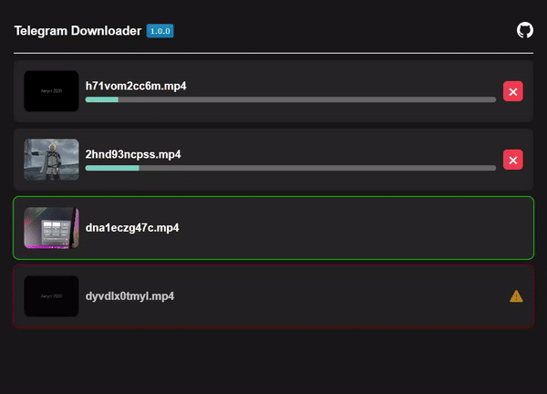

# Telegram Downloader


<a href="#donate"></a>

### Downloads photos and videos from Telegram Web private channels

## Installation:

###  [Chrome Web Store](https://chrome.google.com/webstore/detail/telegram-downloader/koiaccdjppbbbjhieeccphdmbiokadbd)
###  Firefox Extension Workshop 

### Chrome:
  1. Download latest **[Release](https://github.com/SuperZombi/telegram-downloader/releases)**.
  2. Extract the archive to an installation location.
  3. ```⋮``` > "Additional tools" > "Extensions".
  4. Turn on "Developer Mode".
  5. Press "Load unpacked extension".
  6. Select the path to the unpacked folder.


<hr>
<details>
<summary>What this extension do</summary>

#### For Web-K version:
* Just returns the hidden download button

#### For Web-A version:
* Adds a download button
* Adds a downloading animation for this button
* Adds a download manager (call the extension popup)

</details>


<br/>


#### Downloads Manager


<hr>

#### 💲Donate

<table>
  <tr>
    <td>
       
    </td>
    <td>
      <a href="https://donatello.to/super_zombi">Donatello</a>
    </td>
  </tr>
  <tr>
    <td>
       
    </td>
    <td>
      <a href="https://www.donationalerts.com/r/super_zombi">Donation Alerts</a>
    </td>
  </tr>
</table>
